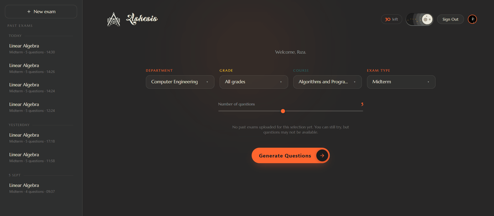
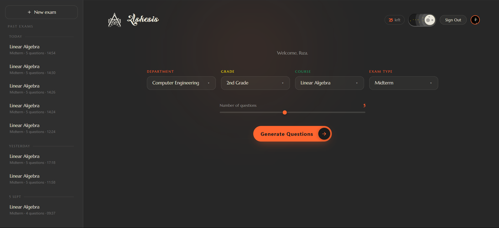
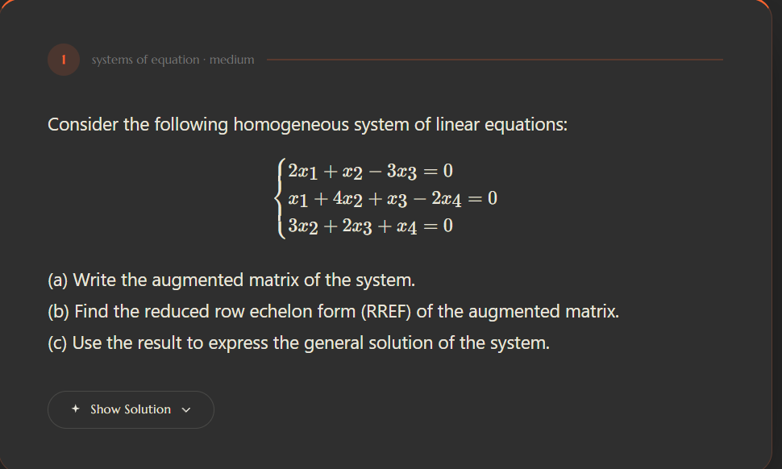
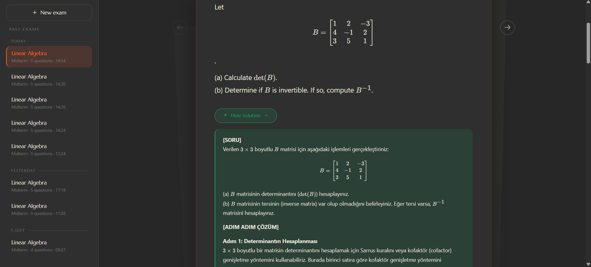
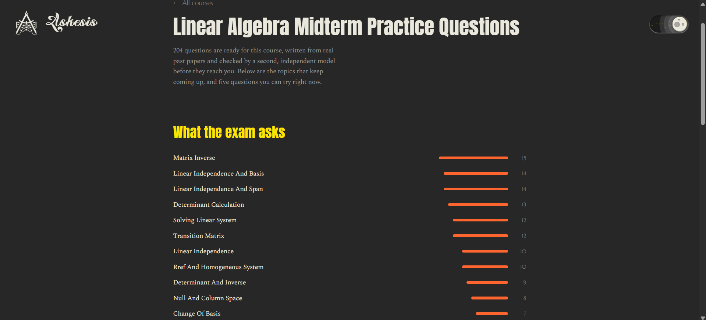
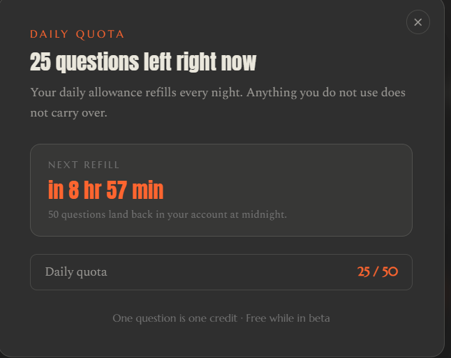
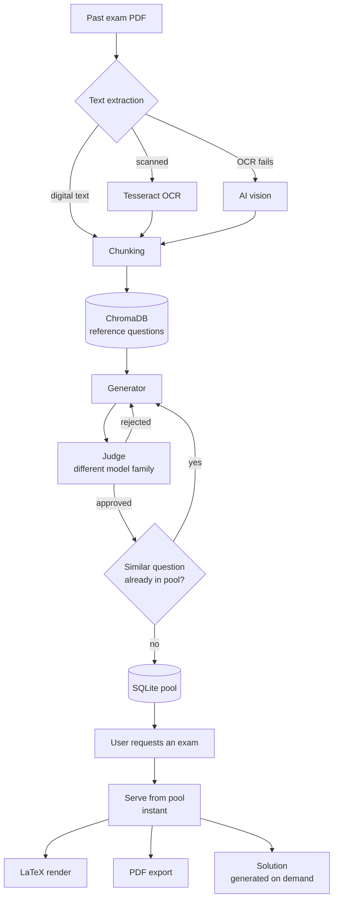

<a id="top"></a>

<div align="center">

<picture>
  <source media="(prefers-color-scheme: dark)" srcset="docs/wordmark-dark.png" />
  
</picture>

**Practice exams generated from your course's real past papers.**


Not a question bank. Askesis reads the papers your department actually set,
learns what they ask, and writes new questions in the same shape — checked by a
second model before you ever see them.

[](https://askesisapp.net)
[](LICENSE)


<br />

[**Try it**](https://askesisapp.net) · [How it works](#how-it-works) · [Run it yourself](#running) · [Notes from building it](#notes) · [FAQ](#faq)

<br />



<br /><br />



<sub>Pick a course, choose how many questions, and read the set that comes back.</sub>

</div>

---

<a id="what-it-does"></a>
##  What it does

You pick a course and an exam type. A few seconds later you have a fresh set of
questions that look like they came out of your department's exam, with worked
solutions and a printable PDF.

The questions are not retrieved from a bank and they are not the past papers
themselves. They are written for you, from the papers, each time.

It is free. Every account gets a batch of questions each day and the counter
refills at midnight — no packages, no checkout.

<table>
<tr>
<td width="50%" valign="top">

**Grounded in real papers**

Every question is generated from chunks of actual past exams stored in a vector
database. The model does not invent a syllabus — it works from what your
department has already asked.

</td>
<td width="50%" valign="top">

**Judged before delivery**

A second model from a different family reviews each question and rejects the
ones that are mathematically or structurally broken. Roughly two in five do not
survive.

</td>
</tr>
<tr>
<td width="50%" valign="top">

**Figures that are actually correct**

The model writes drawing code, not an image. The code runs in a sandbox and
produces the figure. A plotted function is genuinely plotted; a circuit is
genuinely built.

</td>
<td width="50%" valign="top">

**Exam sheets, not screenshots**

LaTeX rendering in the browser and a real PDF export you can print and sit down
with.

</td>
</tr>
</table>

---

<a id="screenshots"></a>
##  Screenshots

<div align="center">



<em>Pick a course and an exam type, choose how many questions.</em>

<br /><br />

<table>
<tr>
<td></td>
<td></td>
</tr>
<tr>
<td align="center"><em>A question, rendered with KaTeX</em></td>
<td align="center"><em>Worked solution, written on request</em></td>
</tr>
<tr>
<td></td>
<td></td>
</tr>
<tr>
<td align="center"><em>Printable exam sheet</em></td>
<td align="center"><em>Public course page — what the exam keeps asking</em></td>
</tr>
<tr>
<td colspan="2" align="center">

<br /><em>The daily quota, counting down to midnight</em>
</td>
</tr>
</table>

</div>

---

<a id="how-it-works"></a>
##  How it works



### The pool is the point

Generating on demand would mean every user waits fifteen seconds and every
request costs tokens. Instead a background worker keeps a pool topped up, and
requests are served from it instantly. The LLM is only touched when the pool
runs dry.

This also makes free-tier quotas survivable. When a provider returns 429 the
chain falls through to the next one and puts the exhausted provider on a
cooldown, but most user requests never reach a provider at all.

### Everyone gets a daily quota

A quota rather than a paywall, for a practical reason: without one, a single
user holding down the generate button drains the day's free-tier LLM quota and
the site closes for everyone. The counter resets at midnight, and unused
questions do not carry over. Anything granted by hand sits on top and is spent
last, so a gift is not quietly eaten by the free allowance.

### Three providers, one chain

```
Groq  →  Google  →  OpenRouter
```

Each stage is `provider:model`. On failure the next one takes over and the
failed provider is rested. Generation, judging, solving and vision each have
their own chain, because the requirements differ — the judge deliberately comes
from a different model family than the generator, since a model is poor at
catching its own mistakes.

---

<a id="tech"></a>
##  Tech

| Layer | Choice | Why |
|---|---|---|
| Frontend | Next.js 16 (App Router), React 19, Tailwind 4 | Course pages are server components, so search engines see the content without running JavaScript |
| Hosting (web) | Vercel | Free tier, global edge, keeps load off the VPS |
| Backend | FastAPI + uvicorn on a VPS | Single worker by design — the scheduler and provider cooldowns are in-process |
| Auth | Clerk | JWT verified against JWKS on every request |
| Vector store | ChromaDB | Reference chunks from uploaded papers |
| Database | SQLite in WAL mode | One writer, low volume; backed up through SQLite's own backup API, not a file copy |
| Rendering | KaTeX in the browser, TeX Live for PDF | Same source, two targets |
| Figures | matplotlib and schemdraw, sandboxed | |

---

<a id="running"></a>
##  Running it yourself

### Requirements

- Python 3.11+
- Node 20+
- TeX Live (only if you want PDF export)
- Tesseract (only if you want OCR on scanned papers)
- At least one LLM API key — [Groq](https://console.groq.com) is free and enough to start
- A [Clerk](https://dashboard.clerk.com) application

### Backend

```bash
git clone https://github.com/TheFierroS/askesis.git
cd askesis/backend

python -m venv .venv
source .venv/bin/activate        # Windows: .venv\Scripts\activate
pip install -r requirements.txt

cp .env.example .env             # then fill it in, see below
uvicorn app.main:app --reload --port 8000
```

Check that it came up:

```bash
curl -s http://127.0.0.1:8000/health
```

`latex` and the OCR layer are optional — the service reports them as missing and
keeps working without them.

### Frontend

```bash
cd ../frontend
npm install

cp .env.example .env.local
npm run dev
```

Open `http://localhost:3000`.

### Environment

<details>
<summary><b>backend/.env</b> — providers, Clerk, quota</summary>

<br />

| Key | Required | Notes |
|---|---|---|
| `GROQ_API_KEY` | yes | The only mandatory provider |
| `OPENROUTER_API_KEY` | no | Adds a fallback stage |
| `GOOGLE_API_KEY` | no | Needed for AI vision on scanned papers |
| `CLERK_JWKS_URL` | yes | Clerk dashboard → API keys |
| `CLERK_SECRET_KEY` | no | Shows names and emails in the admin panel |
| `CLERK_ADMIN_USER_IDS` | yes | Comma separated `user_…` ids |
| `ALLOWED_ORIGINS` | yes | Your frontend origin. Never `*` |
| `DAILY_FREE_QUOTA` | no | Questions per user per day, default 50 |
| `AUTH_DEV_MODE` | no | Skips JWT verification. **Local only** |

</details>

<details>
<summary><b>frontend/.env.local</b> — API URL and Clerk keys</summary>

<br />

| Key | Notes |
|---|---|
| `NEXT_PUBLIC_API_URL` | Backend base URL |
| `NEXT_PUBLIC_CLERK_PUBLISHABLE_KEY` | `pk_test_…` locally, `pk_live_…` in production |
| `CLERK_SECRET_KEY` | Server side only |

</details>

### First run

1. Sign in once so Clerk creates your user.
2. Copy your `user_…` id from the Clerk dashboard into `CLERK_ADMIN_USER_IDS`, restart.
3. Go to `/admin`, upload a past paper for a course.
4. Wait for the worker, or fill the pool by hand:

```bash
python -c "from app.workers.refill import refill_once; print(len(refill_once()), 'questions')"
```

5. Generate an exam from the dashboard.

> A course only appears once at least one paper has been uploaded for it. There
> is nothing to generate from otherwise.

---

<a id="layout"></a>
##  Layout

<details>
<summary>Where things live</summary>

<br />

```
backend/
├── app/
│   ├── main.py            API endpoints
│   ├── config.py          Settings, fails fast on missing keys
│   ├── prompts.py         Model instructions
│   ├── schemas.py         Pydantic contracts for LLM output and API bodies
│   ├── auth.py            Clerk JWT verification
│   ├── services/
│   │   ├── generator.py   Generation loop
│   │   ├── judge.py       Second-model review
│   │   ├── llm.py         Provider chain, cooldowns, JSON repair
│   │   ├── pool.py        Question pool
│   │   ├── credits.py     Daily quota and granted credits
│   │   ├── retrieval.py   Chroma queries
│   │   ├── extraction.py  PDF → text, three layers
│   │   ├── figures.py     Sandboxed figure rendering
│   │   └── latex.py       PDF generation
│   └── workers/refill.py  Background pool filler
└── scripts/
    ├── repair_questions.py  Scans the pool for broken LaTeX and fixes it
    ├── clear_pool.py        Removes questions by course
    ├── dump_questions.py    Inspects raw question text
    └── backup.py            Consistent SQLite + Chroma snapshot

frontend/src/
├── app/
│   ├── page.tsx           Landing
│   ├── courses/           Public, server rendered, indexable
│   ├── dashboard/         The product
│   └── admin/             Uploads, pool, users
├── components/
└── lib/
```

</details>

---

<a id="notes"></a>
##  Notes from building it

Things that were not obvious until they broke.

**One uvicorn worker, not more.** The refill scheduler runs in-process, so two
workers means two schedulers racing through the LLM quota. Provider cooldown
counters live in memory and are not shared either.

**SQLite backups need the backup API.** In WAL mode the database spans three
files, and copying the main file mid-write produces a torn snapshot. The backup
API takes a consistent copy while the app is running.

**Day boundaries need a fixed offset, not `ZoneInfo`.** If `tzdata` is missing
on the server, `ZoneInfo` fails quietly and the quota resets at 03:00 local time
instead of midnight.

**A network error is not a 404.** When a build-time fetch failed and the page
called `notFound()`, Next.js baked that 404 into a static page — so a course
that exists stayed 404 after the API recovered. The two cases have to be told
apart.

**A valid JSON escape can still be the wrong answer.** The obvious LaTeX-in-JSON
failure is loud: `\alpha` is not a valid escape, parsing throws, and a repair
pass fixes it. The quiet one took much longer to find. `\right` *is* valid —
`\r` is a carriage return — so parsing succeeds and the command silently
becomes `CR + "ight"`. No exception, no log line, just `ight\}` on screen. The
repair had to move ahead of parsing rather than behind it.

The same collapse costs matrices their row separators: `\\` in JSON decodes to
a single backslash, and every row of a `bmatrix` falls onto one line.

**Consume credits after generating, not before.** Ask for five, get three,
charge three.

**Repairs need a way to reach questions already written.** Fixing the generator
does nothing for the pool, and those questions cost real tokens. A maintenance
script that classifies the damage and repairs what it safely can was worth more
than deleting and regenerating.

---

<div align="right"><a href="#top">↑ back to top</a></div>

---

<a id="faq"></a>
##  FAQ

<details>
<summary><b>Is this just a question bank with extra steps?</b></summary>

<br />

No. A bank hands back the same questions to everyone. Here the past papers are
reference material, not inventory — every set is written when you ask for it,
and two students picking the same course get different questions.

</details>

<details>
<summary><b>Are the questions actually correct?</b></summary>

<br />

Most of them. A second model from a different family reviews each one and
rejects the broken ones before they reach the pool, which removes the majority
of the bad output but not all of it. Treat them as practice, not as an answer
key. If one looks wrong, it might be.

</details>

<details>
<summary><b>My course is not listed.</b></summary>

<br />

A course shows up only after at least one past paper has been uploaded for it —
there is nothing to generate from otherwise. Variety scales with how many papers
a course has, not with how long the worker runs.

</details>

<details>
<summary><b>What does it cost?</b></summary>

<br />

Nothing. Every account gets a batch of questions each day and the counter
refills at midnight. Solutions and PDF exports are included.

</details>

<details>
<summary><b>Why free LLM tiers instead of a paid API?</b></summary>

<br />

Because a student built it. Three free providers in a fallback chain give more
headroom than one, and the pool means most requests never touch a provider at
all. Per-question cost is pennies; the server is the real expense.

</details>

---

<a id="license"></a>
##  License

MIT — see [LICENSE](LICENSE).

Uploaded exam papers are not part of this repository and are not redistributed.

---

<div align="center">

If this was useful, or just interesting to read, a star helps more than you would think.

<sub>Built by <a href="https://github.com/TheFierroS">@TheFierroS</a> · <a href="https://askesisapp.net">askesisapp.net</a></sub>

<a href="#top">↑ back to top</a>

</div>